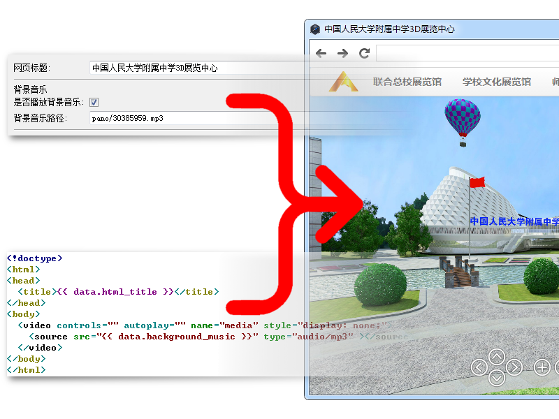

website-builder
===============

Build website from given HTML template and form data.



## Setup for Linux

Download nw.js and extract to `/opt`.

Set a environment variable, and add these lines to `~/.bashrc`

```
# nw.js
export nw=~/opt/nwjs-v0.12.3-linux-x64/nw
```

Open a new teminal window, cd to the path containing `package.json`

```
cd $dir_of_package_json
./run.sh
```

## Setup for Windows

Download nw.js and extract to `D:\opt`.

Set a environment variable

```
nw = D:\opt\nwjs-v0.12.3-win-x64\nw.exe
```

Double click `run.bat` to run this Application.
